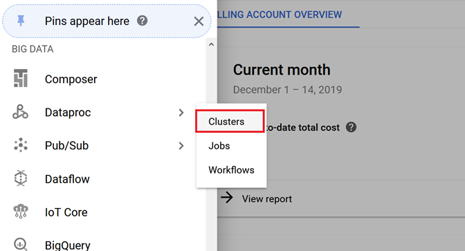
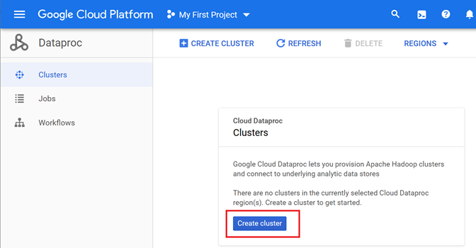
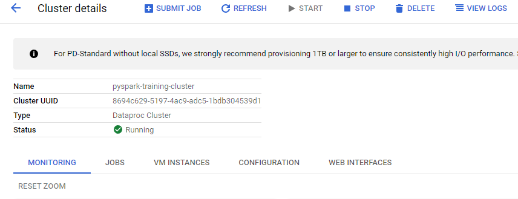
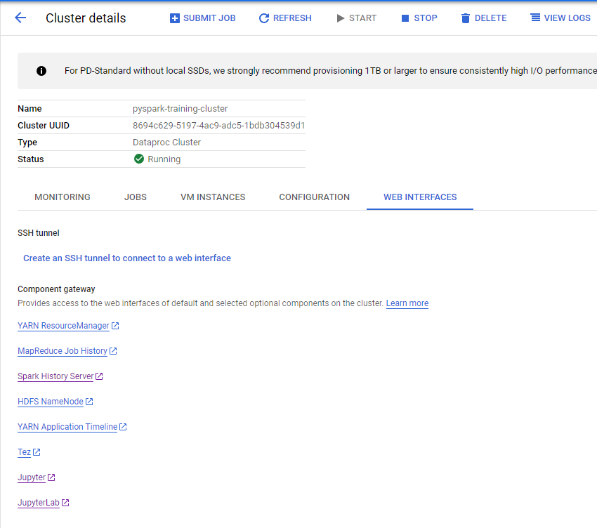
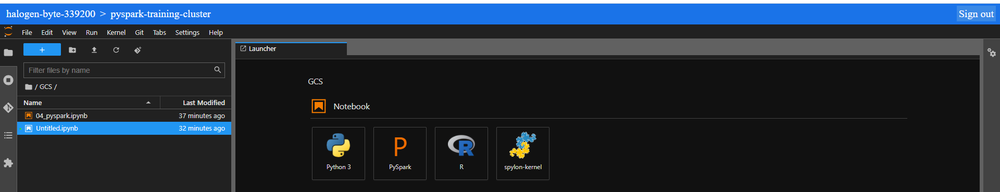

# Using PySpark in Google Dataproc Clusters 

### This guide is made for those who are having problems installing and using PySpark in your own machine. I really think you should try other methods presented in DE-Zoomcamp course. 

## Warnings and heads-up
* I must remind you that this has costs inside GCP platform.
* This could be usefull if you find yourself in one of the following conditions:
    * You tried to install Spark in your local machine and didn't worked;
    * You tried to install PySpark using pip install and didn't worked;
    * You tried to install PySpark with Anaconda as package manager and also didn't worked;
    * You tried to install Spark/PySpark in another kind of VM and didn't worked;
    * Like me, you just can't handle curiosity =) 

My thoughts are simple: it's a easier alternative than creating a VM Instance in GCP, but has its own caveat like the usage of HDFS to access files.

## Assumptions

I will assume that you have a GCP acccount up and running and already enabled Dataproc API in your project. 

This is the link for [Dataproc](https://cloud.google.com/dataproc). 

## 1. First Step - Create a cluster in Dataproc. 

After enabling everything for Dataproc, you can look for creating your cluster

You can go with a lightweight configuration using:
* Easy name and setup your location;
* Standard cluster type (1 master, N workers);
* No autoscaling policy;
* Versioning can go with whatever you like, personally I'm always using 2.0 images with Ubuntu, Hadoop 3.2 and Spark 3.1;
* Enable component gateway so you can access your cluster web interfaces and its Optional components;
* Check for Jupyter Notebook in the 'Optional components'. 

I haven't tweaked any other configurations for this but you can dig into it. 
You still can configure nodes, customize your cluster and set security options.

Now you are ready to create your Dataproc Cluster.

It may take a while to start running.

## 2. Connecting to your cluster and creating your first notebook

With your cluster running, you can click on it

Go to 'Web Interfaces' and open 'JupyterLab'

A new tab will open with JupyterLab. Now you are ready to create your notebook and start coding. 

Select the orange 'PySpark' in the first row 'Notebook' and a fresh file will be created for you.

Now you can start setting up Spark and testing. The guide continues in [this notebook](04_pyspark_dataproc_cluster.ipynb).

## 3. TBD Troubleshooting

By now, my only problem was file path that was fixed using HDFS.

Other issues include just rebooting the cluster if anything freezes. 

What I want to try and you can help me with is:
* Connect via SSH to the cluster using Visual Studio Code;
* Setting up a SSH Tunnel.  
